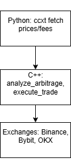

## Architecture
- Python: Fetches prices/fees via ccxt (WebSocket/async), calls C++ module.
- C++: Analyzes arbitrage (spread calc), executes trades (buy → withdraw → sell).
- Flow: Prices → Analyze (if spread > 0.5%) → Trade → Log/Alert.
